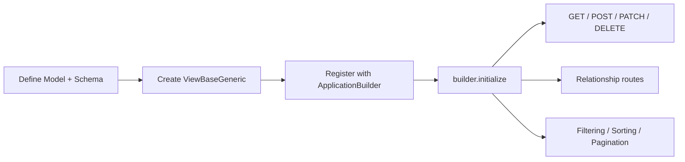
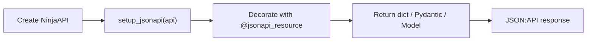

# django-ninja-jsonapi

JSON:API toolkit for Django Ninja.

[](https://github.com/ignacemaes/django-ninja-jsonapi/actions/workflows/ci.yml)
[](https://github.com/ignacemaes/django-ninja-jsonapi/actions/workflows/package.yml)
[](https://pypi.org/project/django-ninja-jsonapi/)
[](https://github.com/astral-sh/ruff)
[](https://github.com/astral-sh/ty)

This project ports the core ideas of `fastapi-jsonapi` to a Django Ninja + Django ORM stack, following the [JSON:API specification](https://jsonapi.org/).

Full documentation is available at [ignacemaes.com/django-ninja-jsonapi](https://ignacemaes.com/django-ninja-jsonapi/).

## Two ways to use the library

`django-ninja-jsonapi` offers two APIs that can be used independently or together:

| | **ApplicationBuilder** | **Standalone Renderer** |
|---|---|---|
| **Use case** | Full auto-generated CRUD | Manual endpoint control |
| **Routes** | Generated from model + schema | You define each `@api.get` / `@api.post` |
| **Data layer** | Built-in Django ORM layer | Bring your own queries |
| **Best for** | Rapid resource APIs | Custom logic, gradual adoption |

### ApplicationBuilder

Auto-generates CRUD routes, relationship endpoints, filtering, sorting, pagination, and includes from a model + schema pair.



### Standalone Renderer

Lets you write normal Django Ninja endpoints while the renderer handles JSON:API serialization (`data`, `attributes`, `relationships`, `links`).



## Requirements

- Python 3.10+
- Django 4.2+
- Django Ninja 1.0+

## Install

```bash
uv add django-ninja-jsonapi
```

or

- `pip install django-ninja-jsonapi`
- `poetry add django-ninja-jsonapi`
- `pdm add django-ninja-jsonapi`

## Quick start — ApplicationBuilder

### 1) Define a Django model and a schema

```python
from django.db import models
from pydantic import BaseModel


class Customer(models.Model):
    name = models.CharField(max_length=128)


class CustomerSchema(BaseModel):
    name: str
```

### 2) Create a JSON:API view class

```python
from django_ninja_jsonapi import ViewBaseGeneric


class CustomerView(ViewBaseGeneric):
    pass
```

### 3) Register resources with `ApplicationBuilder`

```python
from ninja import NinjaAPI

from django_ninja_jsonapi import ApplicationBuilder

api = NinjaAPI()
builder = ApplicationBuilder(api)

builder.add_resource(
    path="/customers",
    tags=["customers"],
    resource_type="customer",
    view=CustomerView,
    model=Customer,
    schema=CustomerSchema,
)

builder.initialize()
```

### 4) Mount API in Django URLs

```python
from django.urls import path
from .api import api

urlpatterns = [
    path("api/", api.urls),
]
```

This generates `GET`, `POST`, `PATCH`, `DELETE` endpoints plus relationship routes — all with JSON:API query support (filtering, sorting, pagination, includes, sparse fieldsets).

## Quick start — Standalone Renderer

### 1) Set up the API

```python
from ninja import NinjaAPI
from pydantic import BaseModel

from django_ninja_jsonapi import jsonapi_resource, setup_jsonapi

api = NinjaAPI()
setup_jsonapi(api)
```

### 2) Define an endpoint

```python
class ArticleSchema(BaseModel):
    id: int
    title: str


@api.get("/articles/{article_id}", response=ArticleSchema)
@jsonapi_resource("articles")
def get_article(request, article_id: int):
    return {"id": article_id, "title": "Hello"}
```

You write the endpoint logic; the renderer wraps it in a JSON:API envelope. Use `jsonapi_include`, `jsonapi_meta`, and `jsonapi_links` helpers for sideloading, metadata, and link objects. See the [standalone renderer docs](https://ignacemaes.com/django-ninja-jsonapi/standalone_renderer/) for pagination, relationships, OpenAPI schemas, request body parsing, and a full CRUD example.

### Example response

`GET /api/articles/1/`

```json
{
  "data": {
    "type": "articles",
    "id": "1",
    "attributes": {
      "title": "Hello"
    },
    "links": {
      "self": "http://localhost:8000/api/articles/1/"
    }
  }
}
```

Resources have a `type` and `id` at the top level while model fields are nested under `attributes`.
Relationships, includes, sparse fieldsets, filtering, sorting and pagination all follow the [JSON:API specification](https://jsonapi.org/format/).

## Configuration

Set JSON:API options in Django settings:

```python
NINJA_JSONAPI = {
    "MAX_INCLUDE_DEPTH": 3,
    "MAX_PAGE_SIZE": 20,
    "ALLOW_DISABLE_PAGINATION": True,
    "INCLUDE_JSONAPI_OBJECT": False,
    "JSONAPI_VERSION": "1.0",
    "INFLECTION": "dasherize",  # or "camelize", or None (default)
}
```

Additional view/schema options:

- `django_filterset_class` on a `ViewBaseGeneric` subclass to enable optional django-filter integration.
- `JSONAPIMeta.meta_fields` (or `Meta.meta_fields`) on schema classes to expose selected fields in resource `meta`.

## Exported public API

```python
from django_ninja_jsonapi import (
    ApplicationBuilder,
    QueryStringManager,
    HTTPException,
    BadRequest,
    ViewBaseGeneric,
    JSONAPIRenderer,
    jsonapi_resource,
    jsonapi_include,
    jsonapi_meta,
    jsonapi_links,
)
```

## Contributing

See [CONTRIBUTING.md](CONTRIBUTING.md) for setup, local checks, contribution workflow, and maintainer release notes.
