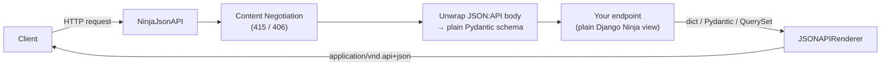

# django-ninja-jsonapi

JSON:API toolkit for Django Ninja.

[](https://github.com/ignacemaes/django-ninja-jsonapi/actions/workflows/ci.yml)
[](https://github.com/ignacemaes/django-ninja-jsonapi/actions/workflows/package.yml)
[](https://codecov.io/gh/IgnaceMaes/django-ninja-jsonapi)
[](https://pypi.org/project/django-ninja-jsonapi/)
[](https://pypi.org/project/django-ninja-jsonapi/)
[](https://pypi.org/project/django-ninja-jsonapi/)
[](https://pypi.org/project/django-ninja-jsonapi/)
[](https://github.com/astral-sh/ruff)
[](https://github.com/astral-sh/ty)
[](https://github.com/astral-sh/uv)

This project brings [JSON:API specification](https://jsonapi.org/) support to Django Ninja.

Full documentation is available at [ignacemaes.com/django-ninja-jsonapi](https://ignacemaes.com/django-ninja-jsonapi/).

## Status

- Transparent JSON:API wrapping — write plain Django Ninja views, get JSON:API documents automatically.
- Auto-detected relationships from Pydantic schema type hints.
- Strict query parsing for JSON:API-style `filter`, `sort`, `include`, `fields`, and `page` parameters.
- JSON:API exception payload handling.
- Content-type negotiation (415/406) per the JSON:API spec.
- Attribute key inflection (`dasherize` or `camelize`).

## Requirements

- Python 3.10+
- Django 4.2+
- Django Ninja 1.0+

## Install

```bash
uv add django-ninja-jsonapi
```

or

- `pip install django-ninja-jsonapi`
- `poetry add django-ninja-jsonapi`
- `pdm add django-ninja-jsonapi`

## Quick start

### 1) Define a Django model and schemas

```python
from typing import ClassVar

from django.db import models
from pydantic import BaseModel

from django_ninja_jsonapi import JsonApiMeta


class Customer(models.Model):
    name = models.CharField(max_length=128)


class CustomerSchema(BaseModel):
    id: int
    name: str

    jsonapi_meta: ClassVar[JsonApiMeta] = JsonApiMeta(resource_type="customers")


class CustomerCreateSchema(BaseModel):
    name: str
```

### 2) Create your API with `NinjaJsonAPI`

```python
from django_ninja_jsonapi import NinjaJsonAPI

api = NinjaJsonAPI()


@api.get("/customers", response=list[CustomerSchema])
def list_customers(request):
    return Customer.objects.all()


@api.get("/customers/{customer_id}", response=CustomerSchema)
def get_customer(request, customer_id: int):
    return Customer.objects.get(pk=customer_id)


@api.post("/customers", response={201: CustomerSchema})
def create_customer(request, body: CustomerCreateSchema):
    customer = Customer.objects.create(**body.model_dump())
    return 201, customer
```

### 3) Mount API in Django URLs

```python
from django.urls import path
from .api import api

urlpatterns = [
    path("api/", api.urls),
]
```

### Example response

`GET /api/customers/1`

```json
{
  "data": {
    "type": "customers",
    "id": "1",
    "attributes": {
      "name": "Alice"
    }
  }
}
```

`GET /api/customers`

```json
{
  "data": [
    {
      "type": "customers",
      "id": "1",
      "attributes": { "name": "Alice" }
    },
    {
      "type": "customers",
      "id": "2",
      "attributes": { "name": "Bob" }
    }
  ]
}
```

Resources have a `type` and `id` at the top level while model fields are nested under `attributes`.
Relationships, includes, sparse fieldsets, filtering, sorting and pagination all follow the [JSON:API specification](https://jsonapi.org/format/).

## Architecture

`NinjaJsonAPI` is a `NinjaAPI` subclass that transparently wraps responses in JSON:API documents and unwraps JSON:API request bodies into plain Pydantic schemas.


```mermaid
flowchart LR
    Client -->|HTTP request| NinjaJsonAPI
    NinjaJsonAPI --> ContentNegotiation["Content Negotiation\n(415 / 406)"]
    ContentNegotiation --> Unwrap["Unwrap JSON:API body\n→ plain Pydantic schema"]
    Unwrap --> Endpoint["Your endpoint\n(plain Django Ninja view)"]
    Endpoint -->|"dict / Pydantic / QuerySet"| JSONAPIRenderer
    JSONAPIRenderer -->|"application/vnd.api+json"| Client
```

## Configuration

Set JSON:API options in Django settings:

```python
NINJA_JSONAPI = {
    "MAX_INCLUDE_DEPTH": 3,
    "MAX_PAGE_SIZE": 20,
    "ALLOW_DISABLE_PAGINATION": True,
    "INCLUDE_JSONAPI_OBJECT": False,
    "JSONAPI_VERSION": "1.0",
    "INFLECTION": "dasherize",  # or "camelize", or None (default)
}
```

## Exported public API

```python
from django_ninja_jsonapi import (
    NinjaJsonAPI,
    JsonApiMeta,
    ModelSchema,
    JSONAPIRenderer,
    QueryStringManager,
    HTTPException,
    BadRequest,
    NotFound,
    apply_attributes,
    get_rel_id,
    get_rel_ids,
    jsonapi_paginate,
    jsonapi_pagination,
    jsonapi_cursor_pagination,
    jsonapi_include,
    jsonapi_meta,
    jsonapi_links,
    jsonapi_sort,
    jsonapi_filter,
    parse_include,
)
```

## Contributing

See [CONTRIBUTING.md](CONTRIBUTING.md) for setup, local checks, contribution workflow, and maintainer release notes.
