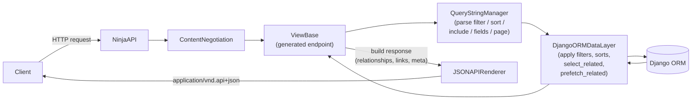
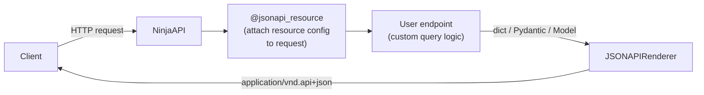

# django-ninja-jsonapi

JSON:API toolkit for Django Ninja.

[](https://github.com/ignacemaes/django-ninja-jsonapi/actions/workflows/ci.yml)
[](https://github.com/ignacemaes/django-ninja-jsonapi/actions/workflows/package.yml)
[](https://pypi.org/project/django-ninja-jsonapi/)
[](https://github.com/astral-sh/ruff)
[](https://github.com/astral-sh/ty)

This project ports the core ideas of `fastapi-jsonapi` to a Django Ninja + Django ORM stack, following the [JSON:API specification](https://jsonapi.org/).

Full documentation is available at [ignacemaes.com/django-ninja-jsonapi](https://ignacemaes.com/django-ninja-jsonapi/).

## Status

- Working baseline for resource registration and route generation (`GET`, `GET LIST`, `POST`, `PATCH`, `DELETE`).
- Strict query parsing for JSON:API-style `filter`, `sort`, `include`, `fields`, and `page` parameters.
- JSON:API exception payload handling.
- Atomic operations endpoint wiring (`/operations`).
- Django ORM data-layer baseline for CRUD + basic relationship handling.
- Top-level/resource/relationship `links` in responses.
- Django ORM include optimization (`select_related`/`prefetch_related` split) with optional include mapping overrides.
- Logical filter groups (`and`/`or`/`not`) and cursor pagination (`page[cursor]`).
- Content-type negotiation (415/406) per the JSON:API spec.
- Attribute key inflection (`dasherize` or `camelize`).
- Auto-generated relationship mutation routes (`POST`/`PATCH`/`DELETE` on to-many, `PATCH` on to-one).

## Requirements

- Python 3.10+
- Django 4.2+
- Django Ninja 1.0+

## Install

```bash
uv add django-ninja-jsonapi
```

or

- `pip install django-ninja-jsonapi`
- `poetry add django-ninja-jsonapi`
- `pdm add django-ninja-jsonapi`

## Quick start

### 1) Define a Django model and a schema

```python
from django.db import models
from pydantic import BaseModel


class Customer(models.Model):
    name = models.CharField(max_length=128)


class CustomerSchema(BaseModel):
    name: str
```

### 2) Create a JSON:API view class

```python
from django_ninja_jsonapi import ViewBaseGeneric


class CustomerView(ViewBaseGeneric):
    pass
```

### 3) Register resources with `ApplicationBuilder`

```python
from ninja import NinjaAPI

from django_ninja_jsonapi import ApplicationBuilder

api = NinjaAPI()
builder = ApplicationBuilder(api)

builder.add_resource(
    path="/customers",
    tags=["customers"],
    resource_type="customer",
    view=CustomerView,
    model=Customer,
    schema=CustomerSchema,
)

builder.initialize()
```

### 4) Mount API in Django URLs

```python
from django.urls import path
from .api import api

urlpatterns = [
    path("api/", api.urls),
]
```

### Example response

`GET /api/customers/1/`

```json
{
  "data": {
    "type": "customer",
    "id": "1",
    "attributes": {
      "name": "Alice"
    },
    "links": {
      "self": "http://localhost:8000/api/customers/1/"
    }
  },
  "meta": {
    "count": 1
  }
}
```

`GET /api/customers/`

```json
{
  "data": [
    {
      "type": "customer",
      "id": "1",
      "attributes": { "name": "Alice" },
      "links": { "self": "http://localhost:8000/api/customers/1/" }
    },
    {
      "type": "customer",
      "id": "2",
      "attributes": { "name": "Bob" },
      "links": { "self": "http://localhost:8000/api/customers/2/" }
    }
  ],
  "meta": {
    "count": 2
  }
}
```

Resources have a `type` and `id` at the top level while model fields are nested under `attributes`.
Relationships, includes, sparse fieldsets, filtering, sorting and pagination all follow the [JSON:API specification](https://jsonapi.org/format/).

## Architecture

The library provides two APIs. Both produce spec-compliant JSON:API responses through `JSONAPIRenderer`.

### ApplicationBuilder — request flow

`ApplicationBuilder` auto-generates CRUD routes from a model + schema pair. Incoming requests flow through the full pipeline:



### Standalone renderer — request flow

With `setup_jsonapi(api)` you write plain Django Ninja endpoints; the `@jsonapi_resource` decorator attaches config to the request and `JSONAPIRenderer` wraps the return value into a JSON:API document.



For full standalone usage (pagination, relationships, OpenAPI schemas, request body parsing, CRUD example), see the [standalone renderer docs](https://ignacemaes.com/django-ninja-jsonapi/standalone_renderer/).

## Configuration

Set JSON:API options in Django settings:

```python
NINJA_JSONAPI = {
    "MAX_INCLUDE_DEPTH": 3,
    "MAX_PAGE_SIZE": 20,
    "ALLOW_DISABLE_PAGINATION": True,
    "INCLUDE_JSONAPI_OBJECT": False,
    "JSONAPI_VERSION": "1.0",
    "INFLECTION": "dasherize",  # or "camelize", or None (default)
}
```

Additional view/schema options:

- `django_filterset_class` on a `ViewBaseGeneric` subclass to enable optional django-filter integration.
- `JSONAPIMeta.meta_fields` (or `Meta.meta_fields`) on schema classes to expose selected fields in resource `meta`.

## Exported public API

```python
from django_ninja_jsonapi import (
    ApplicationBuilder,
    QueryStringManager,
    HTTPException,
    BadRequest,
    ViewBaseGeneric,
    JSONAPIRenderer,
    jsonapi_resource,
    jsonapi_include,
    jsonapi_meta,
    jsonapi_links,
)
```

## Contributing

See [CONTRIBUTING.md](CONTRIBUTING.md) for setup, local checks, contribution workflow, and maintainer release notes.
